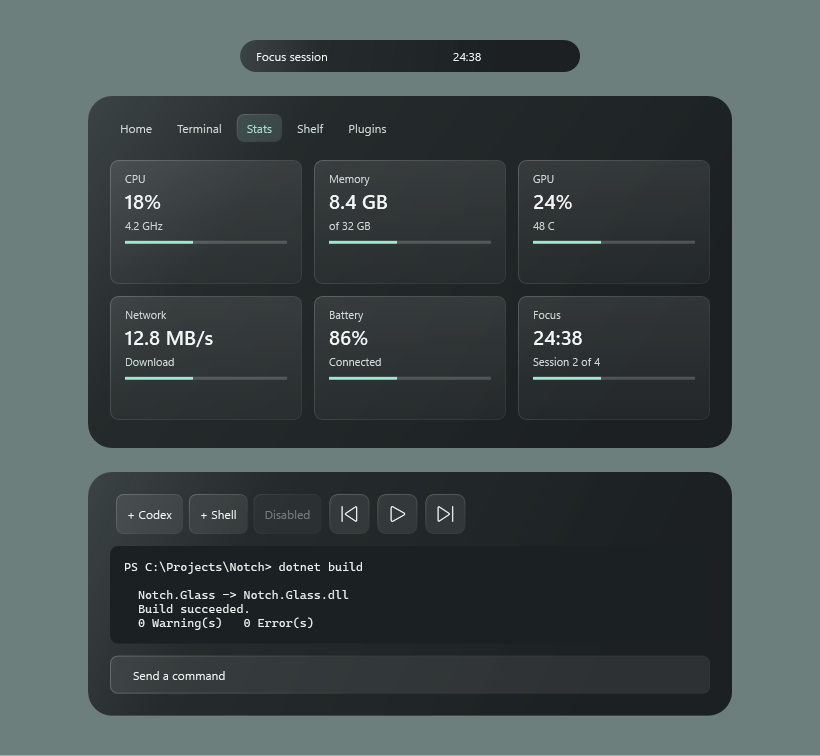
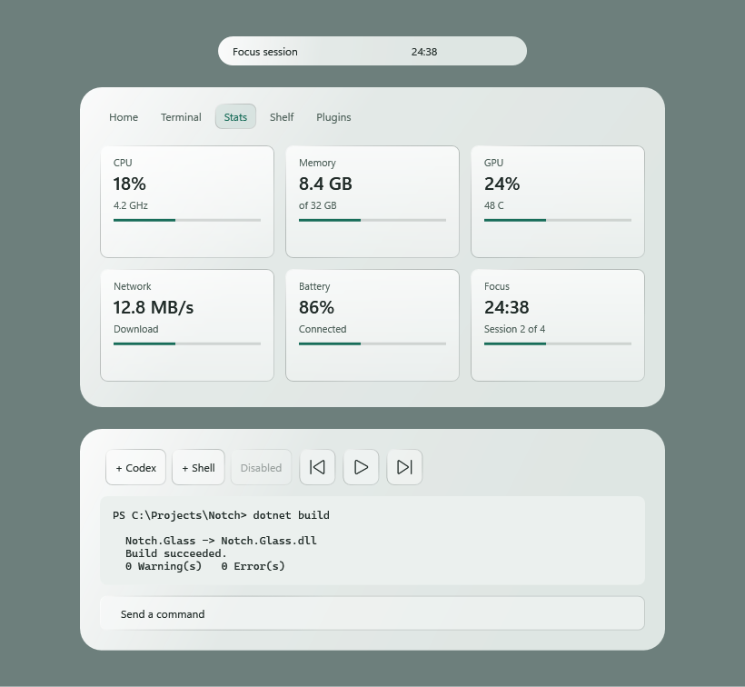

# Notch Glass

A theme plugin for [Brick-Bread/WNotch](https://github.com/Brick-Bread/WNotch), built against its supported **plugin API 6**. Version 0.1.0 offers two looks:

- **Glass / Smoked:** translucent charcoal, silver edges, mint highlights.
- **Glass / Frosted:** translucent white, graphite text, teal highlights.

The themes cover the compact pill, expanded shell, cards, shared buttons, tab strip, text inputs, fonts, radii, progress tracks and terminal palette. Shared resources also colour the shelf and plugin pages. The existing layout, interactions and activity glows remain controlled by Notch.

## Install

In WNotch Settings, under **Plugins**, enter `Brick-Bread/wnotch-glass` and press **Install**, then save. Select **Glass / Smoked** or **Glass / Frosted** under **Plugin theme** and save again. Requires WNotch with plugin API 6 or newer.

Alternatively, download `notch-glass-0.1.0.zip` from [Releases](https://github.com/Brick-Bread/wnotch-glass/releases), extract it into `%AppData%\Notch\plugins\brick-bread.glass`, then enable **Notch Glass** in Settings.

## Previews

These native WPF previews use the shipped styles in a sample layout.





## Build

Requires the .NET 10 SDK and a WNotch build with API 6 or newer. The default reference is the installed `%LocalAppData%\Programs\Notch\Notch.Core.dll`.

```powershell
Set-Location 'path\to\wnotch-glass'
.\build.ps1
```

For a different installation or source build:

```powershell
.\build.ps1 -NotchCorePath 'C:\path\to\Notch.Core.dll'
```

This creates `dist\brick-bread.glass` and `dist\notch-glass-0.1.0.zip`. The plugin does not ship `Notch.Core.dll`, use NuGet packages, poll, access the network or alter saved application settings. Its entry point only registers themes.

## Try in Notch

Quit the running installed copy from its tray menu, then launch a development run from this folder:

```powershell
& "$env:LOCALAPPDATA\Programs\Notch\Notch.exe" "--plugin=$PWD\dist\brick-bread.glass" --plugin-theme=brick-bread.glass/smoked --pin-open --tab=stats
```

Use `--plugin-theme=brick-bread.glass/frosted` for the light variant. The development flags do not save your theme choice. This script does not automatically quit or change your running Notch.

To install permanently, copy `dist\brick-bread.glass` into `%AppData%\Notch\plugins`, enable **Notch Glass** in Settings and save. Select a **Glass** variant under **Plugin theme** and save again. Disabling the plugin lets Notch restore the normal theme.

## Validate and Preview

```powershell
dotnet run --project tools\ThemeCheck -- dist\brick-bread.glass artifacts
```

The native WPF checker loads the shipped dictionaries, checks supported resource types and opaque terminal colours, measures text contrast over black and white desktops, and renders `artifacts\smoked.png` and `artifacts\frosted.png`. It exercises real control templates in a sample layout; it is not an end-to-end test of the running Notch. It also checks theme registration through the installed plugin interface and verifies that the package excludes the host DLL.

## Theme Files

- `GlassThemePlugin.cs`: registers both themes with the host.
- `plugin.json`: the real Notch plugin manifest.
- `themes/smoked.xaml` and `themes/frosted.xaml`: surface and terminal palettes.
- `themes/controls.xaml`: shared fonts, radii and seven supported control styles.

The theme owns its accent colour. Change all three `Accent*Brush` resources together to customise it. Relative dictionary paths work in both build and publish output.

## Current Limits

This first version creates the glass appearance with translucent tints, gradients and fine borders. WNotch's documented theme contract exposes no desktop backdrop-blur setting, so this plugin does not add live acrylic blur. The WebView2 terminal uses opaque colours matched to the shell. Native Windows settings dialogs and controls outside the documented theme resources keep their host styling.

API reference: [WNotch plugin guide](https://github.com/Brick-Bread/WNotch/blob/main/docs/plugins.md#themes-restyling-the-whole-notch). Further work can add a host-supported backdrop option and verify every tab and compact activity against a full app run.

## Releases

GitHub Actions builds and validates the plugin on pushes to `main` and pull requests. Pushing a matching version tag, such as `v0.1.0`, creates a release with exactly one plugin ZIP, which WNotch's installer expects. The workflow pins the WNotch source used for its API reference; local builds use the installed host DLL by default.

## License

MIT. See [LICENSE](LICENSE).
